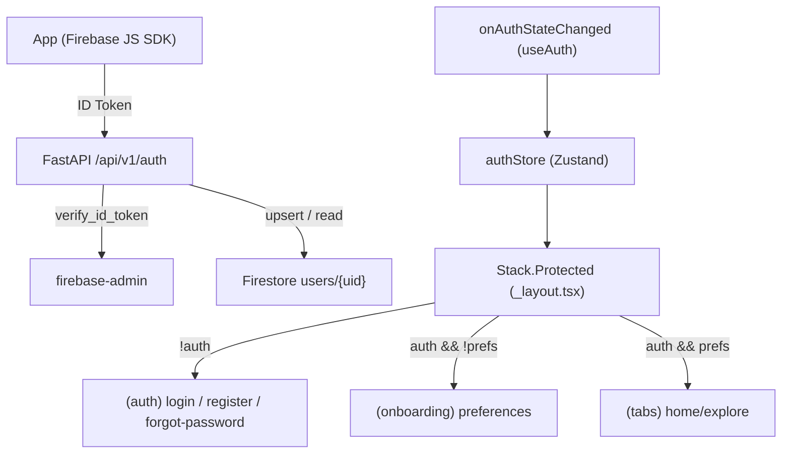

# Autenticação Full Stack (RF01 + Seção 3.3)
> [!success] RF02 coberto
> Recuperação de senha documentada em [[Recuperação de Senha]] (`sendPasswordResetEmail` + tela Monochrome Premium).

Fluxo completo de cadastro, login, sessão persistente e formulário de preferências de viagem no onboarding. Cobre o [[Requisitos Funcionais|RF01]] e a etapa final do cadastro descrita na Seção 3.3 do PRD.

> [!info] Escopo desta entrega
> Dentro: cadastro, login, recuperação de senha (RF02), sessão persistente entre reaberturas, onboarding de preferências, redirect automático.
> Fora (próxima sessão): editar preferências de vibe pós-onboarding (nota RF03), Google Sign-In (dev client).
> Feito: [[Gerenciamento de Perfil RF03]] (editar perfil + exclusão LGPD).

## Princípio central

> [!important] O backend NUNCA recebe senha
> O frontend autentica no Firebase (`createUserWithEmailAndPassword` / `signInWithEmailAndPassword`), recebe um **ID Token**, e envia apenas esse token no header `Authorization: Bearer`. O backend valida o token com `firebase-admin` e extrai o `uid`. Menos superfície de ataque e sessão nativa do Firebase.

## Fluxo ponta a ponta



## Backend (Clean Architecture)

Respeita a separação obrigatória `Routers -> Services -> Repositories` (Seção 2.2 do PRD).

- `backend/core/firebase.py` — inicialização única do Admin SDK + client Firestore (`db`).
- `backend/core/auth_middleware.py` — dependência `get_current_user` (valida ID Token).
- `backend/core/rate_limit.py` — `Limiter` compartilhado do `slowapi`.
- `backend/models/user.py` — `TravelPreferences`, `UserInDB` e enums (`Interest`, `BudgetRange`, `TravelerType`).
- `backend/models/auth.py` — `SyncResponse`, `SavePreferencesRequest`.
- `backend/repositories/user_repository.py` — CRUD no Firestore, async via `run_in_threadpool` (o client do firebase-admin é síncrono).
- `backend/services/auth_service.py` — regras de negócio (`sync_user`, `save_user_preferences`).
- `backend/api/auth_router.py` — rotas com rate limiting de 10/min.

### Rotas

| Método | Rota | Descrição |
|---|---|---|
| POST | `/api/v1/auth/sync` | Cria o doc no primeiro login e retorna `has_preferences`. |
| PUT | `/api/v1/auth/preferences` | Salva as preferências coletadas no onboarding. |

## Frontend

- `frontend/src/lib/firebase.ts` — nativo: `initializeAuth` + `getReactNativePersistence(AsyncStorage)` (persiste sessão). Web/SSR: `getAuth` — a função RN não existe nesse bundle.
- `frontend/src/lib/api.ts` — cliente HTTP que injeta o Bearer token via `getIdToken()`.
- `frontend/src/lib/auth-errors.ts` — mapeia `error.code` do Firebase para chaves de i18n.
- `frontend/src/lib/i18n.ts` + `frontend/src/locales/pt-BR.json` — [[i18n]] desde a primeira tela.
- `frontend/src/stores/authStore.ts` — estado global em [[Zustand]] (`user`, `hasPreferences`, `isLoading`).
- `frontend/src/hooks/useAuth.ts` — liga `onAuthStateChanged` -> store -> `sync`.
- `frontend/src/app/_layout.tsx` — navegação com `Stack.Protected` (guards declarativos).
- Telas: `(auth)/login.tsx`, `(auth)/register.tsx`, `(auth)/forgot-password.tsx`, `(onboarding)/preferences.tsx`.

## Modelo de dados — `users/{uid}`

Ver schema completo e enums em **[[Preferências Sua Vibe]]** (`TravelPreferences` expandido: 14 interesses, pace, transport, dietary).

```
{
  uid: string,
  email: string,
  created_at: timestamp,
  travel_preferences: TravelPreferences | null
}
```

`has_preferences` é sempre **derivado** (`travel_preferences != null`), nunca um campo salvo — evita inconsistência.

## Decisões e desvios

> [!note] Decisões tomadas
> - **Zustand** em vez de Redux/Context (estado pequeno, sem boilerplate).
> - **`Stack.Protected`** em vez de `<Redirect>` manual (padrão declarativo do Expo Router).
> - **Erros inline**, nunca `Alert`.
> - Orçamento como **seletor segmentado** (3 valores discretos) em vez de slider, evitando dependência extra.

> [!warning] Ajustes de infraestrutura necessários
> - `frontend/lib/firebase.ts` usava `getAuth()`, que não persiste sessão no RN — corrigido para `initializeAuth` + AsyncStorage e movido para `src/lib/`.
> - `backend/core/config.py` não declarava `GOOGLE_MAPS_API_KEY` (presente no `.env`), o que quebrava o boot do FastAPI — campo adicionado.
> - Criado `firestore.rules` restringindo `users/{uid}` ao próprio dono (antes não havia regra explícita).

## Segurança

- Rate limiting de 10/min por IP nas rotas de auth ([[Segurança e Compliance]] — Seção 6.2).
- Firestore Security Rules: cada usuário só acessa o próprio documento.
- Nenhuma chave privada no frontend (apenas `EXPO_PUBLIC_*`).
- Recuperação de senha: anti-enumeration via copy — ver [[Recuperação de Senha]].
